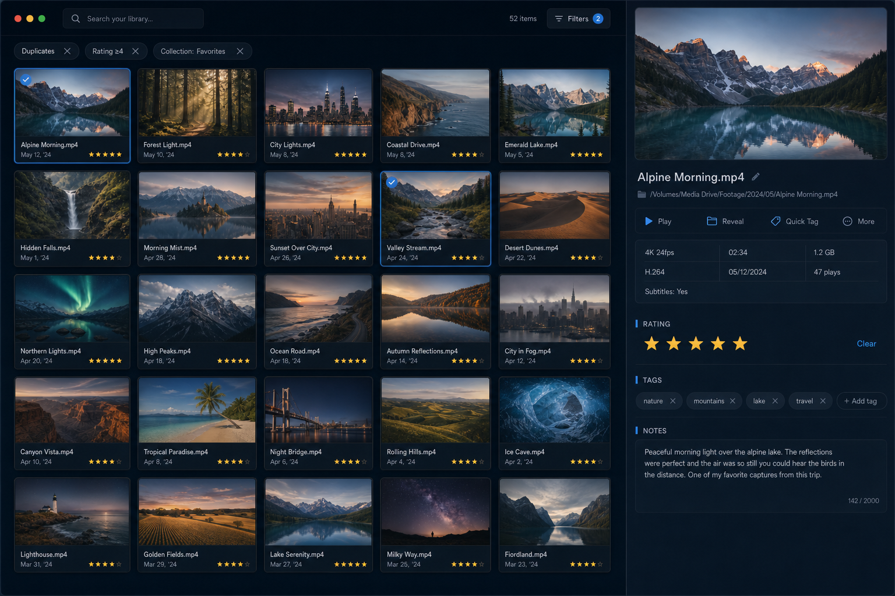
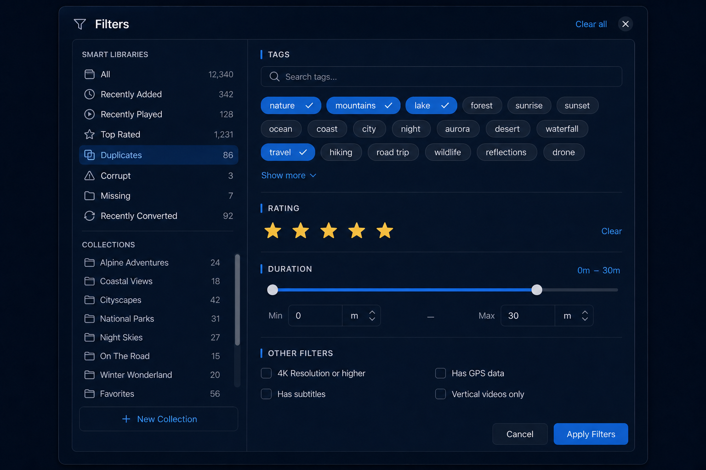
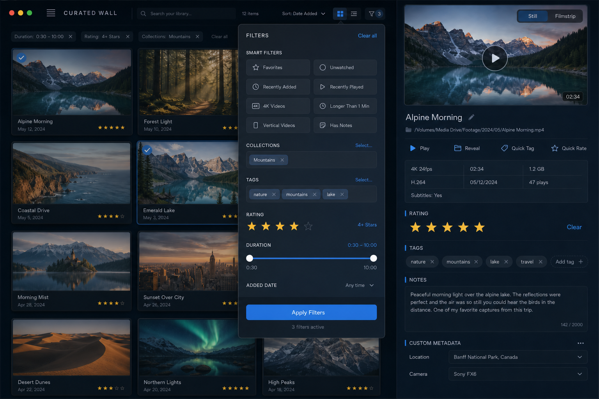
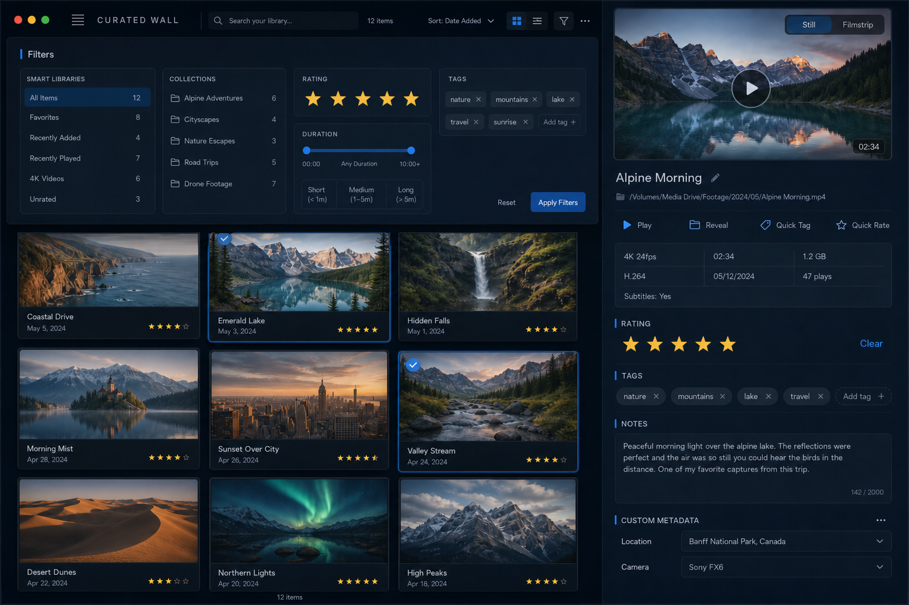
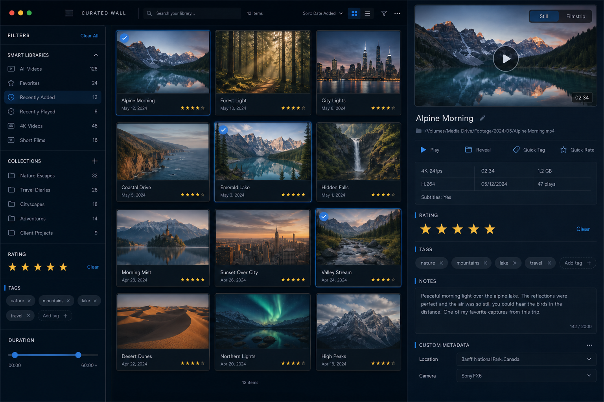
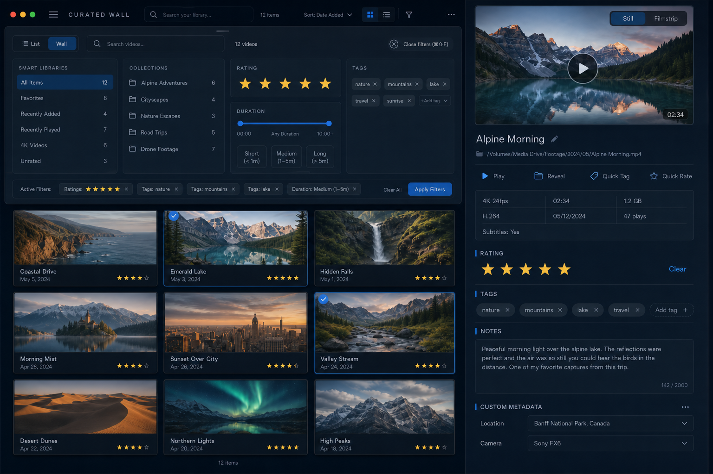

# Curated Wall — Smart Filters, Collections, Tags / Rating / Duration Proposal

**Date:** 2026-06-29  
**Context:** `feature/curated-wall`  
**References:**
- `curated-wall-full-window-mock.png` (open in IDE)
- `curated-wall-cards-refined-mock.png`
- `curated-wall-inspector-detail-mock.png`
- `curated-wall-inspector-multiselect-mock.png`
- `CuratedWall_Readiness_Checklist.md` (especially answers to #3, #16, #17)
- Fresh Workspace Audit 2026-06

---

## Goals (non-negotiable)

1. The **Wall must look and feel like the mockups** — elegant personal gallery, minimal permanent chrome.
2. **All existing power must remain fully available** (smart libraries, collections, tag/rating/duration filters, search, etc.). They may be accessed differently.
3. Filter UI must be **lightweight by default** and **powerful on demand**.
4. Active filters must be **visible and easy to clear** without hunting.
5. The design must work for both single selection and multi-select flows.

---

## Core Principle

**"The wall is sacred."**

The browsing surface stays as close as possible to the clean full-window mock at all times.  
Powerful organization tools live in a transient, high-quality surface (popover or compact panel) + a very light "active filters" summary row.

No always-visible 4-column slab under the wall for this variant.

---

## Proposed UI Structure (Wall area)

### 1. Thin Capability Bar (above the wall content)

Always present, extremely low visual weight:

```
[ List | Wall ]          [search field]          1,284 videos          [Filters ⌵]  (or icon + badge)
```

- List / Wall segmented control (small).
- Search field (subtle rounded, lives here or inside the wall header — either works).
- Video count (monospaced digits, low weight).
- **Filters button** (right-aligned):
  - Default: ghost / subtle icon + "Filters" label.
  - When any filter active beyond "All": shows a small filled badge with the count of active constraints (e.g. "3").
  - Clicking opens the **Filters Popover**.

This bar is intentionally thin (see current `wallBrowserPane` header).

### 2. Active Filter Pills Row (conditional)

Rendered **only** when one or more meaningful filters are active:

```
[Duplicates] [Rating ≥4] [Collection: Favorites] [Tags: vacation + 2 more] [5–30 min]   [Clear all]
```

- Light capsules, easy to click to remove individual constraints.
- "Clear all" at the far right (or as a small link).
- Clicking a pill can either:
  - Immediately remove that filter, **or**
  - Open the popover pre-focused on that section (better for editing complex ones like tags or duration).
- The row is very short in height and uses the same background treatment as the wall header so it doesn't feel like "another bar".

When no filters are active → the pills row is completely absent (wall header sits directly above the cards, matching the mock).

### 3. The Wall Grid / List itself

Unchanged from current Curated Wall direction:
- Generous 5-column (responsive 3–6) LazyVGrid.
- `CuratedWallCard` treatment.
- Search + count header inside the grid view (or merged with the thin bar above).
- Selection drives the right Inspector; wall stays visible.

---

## The Filters Popover (the powerful surface)

Attached to the Filters button. Beautiful, spacious, cinematic-blue aesthetic matching the mocks.

**Header:**
```
Filters                                    Clear all     [×]
```

**Sections (vertical stack, good breathing room, blue left accents on headers):**

### A. Smart Libraries
Single-choice list (radio-like behavior, drives `sidebarFilter`):

- All Videos (count)
- Recently Added
- Recently Played
- Top Rated
- Duplicates
- Corrupt
- Missing
- Recently Converted

Each row: icon + name + right-aligned count.  
Selected row has subtle background or check + blue accent.

Toggles for visibility of the "advanced" ones (Duplicates, Corrupt, etc.) can live in a small "Customize..." or simply always show the core set and let the model decide (current `showDuplicates` etc. still respected).

### B. Collections
- Scrollable list of collections (name + count).
- Selecting a collection sets `sidebarFilter = .collection(...)`.
- "+ New Collection" button at the bottom (opens the existing `CollectionEditorView` sheet).
- Optional: allow "no collection filter" (clear).
- Future: multi-collection "any of" if the model expands.

### C. Rating
- Large stars (prominent, size ~22–24).
- Click to set minimum rating (or exact set, depending on desired semantics).
- "Clear rating filter" small action.
- Shows count per star bucket if easy (from `libraryCounts.byRating`).

### D. Tags
- Searchable input or list of existing tags.
- Current selected tags shown as removable chips at top of section.
- "Any" / "All" segmented control for `tagFilterMode`.
- Create new tag inline (same pattern as inspector tag creation).
- This section re-uses / mirrors the tag logic already in `CuratedWallInspector`.

### E. Duration
- Compact, elegant range:
  - Two small numeric fields: "Min" and "Max" (minutes or seconds, displayed nicely).
  - Or a nice dual-thumb range slider + presets.
- Quick presets as pills inside the section:
  - Any | < 1 min | 1–5 min | 5–30 min | > 30 min
- These set `minDurationSeconds` / `maxDurationSeconds` (or equivalent model properties) and participate in `recomputeFilteredVideos()`.

**Footer of popover:**
- "Clear all filters" (destructive weight, left or center)
- "Done" (or just click outside / press Esc — typical popover dismissal)

The popover should be wide enough to feel comfortable (approx 420–520 pt) but not huge. Good internal padding.

---

## Generated Visual Mockups (this proposal)

These were generated to show exactly how the above integrates with the existing full-window mock aesthetic.

**1. Wall with minimal header + active filter pills (no heavy strip):**



**2. The Filters popover itself (detailed sections):**



**3. Full window with popover open over the clean wall:**



These are the target visuals for implementation.

---

## Behavior & State Mapping

| User Action in Proposal UI          | Model Effect                              | Notes |
|-------------------------------------|-------------------------------------------|-------|
| Choose "Duplicates" in Smart Libs   | `sidebarFilter = .duplicates`             | Same as today |
| Choose a Collection                 | `sidebarFilter = .collection(c)`          | Same |
| Set Rating stars                    | `selectedRatingStars = [4,5]`             | Independent of sidebarFilter |
| Select tags + choose "Any"          | `selectedTagIds`, `tagFilterMode = .any`  | Same |
| Set min 5 min / max 30 min          | `minDurationSeconds = 300`, `max...`      | New or ensure wiring |
| Remove a pill                       | Clears the corresponding model field(s)   | Immediate recompute |
| Clear all                           | Reset to defaults (All, no tags, no rating, no duration) | — |
| Search text                         | `searchText`                              | Already live |
| Toggle a smart filter visibility    | `showDuplicates = false` etc.             | Hides from Smart Libraries list + auto-resets active filter if needed |

All of the above must continue to drive the single source of truth: `filteredVideos`.

---

## What Changes in Current Code (high level)

- For Curated Wall variant, **do not** default to showing `BottomFilterColumnsView` in a vertical split.
- The current thin bar (List/Wall + icon button) is a good starting point; evolve the button to open a **popover** instead of (or in addition to) toggling the strip.
- Create (or extract) a new `CuratedWallFiltersPopover` (or `FiltersPopover`) view that presents the sections above, bound to the same `LibraryViewModel` properties.
- The existing `BottomFilterColumnsView` can stay for other workspaces or be offered as an "Advanced / Classic filter strip" option later.
- Add / ensure duration range support in the filter pipeline if the live `minDurationSeconds` / `maxDurationSeconds` properties + predicate logic are not yet fully active on main.
- Pills row can be a small new component (`ActiveFilterPills`) that observes the relevant VM state and renders the capsules.
- Keep `showFilterStrip` or introduce a variant-specific flag (`showCuratedFiltersStrip`) only for users who explicitly want the old 4-column always-visible treatment.

---

## Keyboard & Discoverability

- `⌘⇧F` (or similar) — open the Filters popover with focus on the first section.
- While popover open: arrow keys navigate sections, Esc closes, Return applies/dismisses.
- Search in header: `/` or `⌘F` focuses the search field (existing pattern).
- Clicking a pill can have a modifier-click to "edit in popover".

---

## Multi-Select Considerations

- Filters always apply to the entire wall (the set of visible videos).
- When multi-select is active on the wall, the Inspector shows bulk UI.
- The filter pills / popover remain fully functional and affect what can be multi-selected next.

---

## Duration Filter — Implementation Note

Currently duration is strong in:
- Sorting
- Collection rule definitions (`CollectionRule`)
- List columns

Live wall filtering by duration range (`minDurationSeconds` / `maxDurationSeconds`) appears to be partially planned or present in some branches.

**Proposal:** treat it as a first-class filter in this popover now.
- Add (or expose) the two properties on `LibraryViewModel`.
- Wire them into `recomputeFilteredVideos()` / the snapshot filter logic the same way `selectedTagIds` and `selectedRatingStars` are.
- The popover provides both quick presets and free-form min/max for precision.

If the predicate logic needs work, the UI can be implemented in parallel and the filtering completed shortly after.

---

## Preservation Checklist (from Readiness)

All items from section E of the checklist remain satisfied:

- Smart libraries (recently added/played, top rated, duplicates, corrupt, missing, recently converted) → via Smart Libraries section + `sidebarFilter`
- Collections (browse + create + filter) → via Collections section + "+ New"
- Tag filtering (multi, any/all) → Tags section in popover
- Rating filtering → Rating section
- Duration filtering → Duration section (new emphasis)
- Search → always in header
- Everything else (playback, filmstrip, notes, custom metadata, etc.) lives in the Inspector or global commands and is unaffected.

---

## Visual & Interaction Details to Match Mocks

- Use the same materials, radii, blue accents, typography scale as the refined mocks.
- Popover should feel "inside the app", not a heavy system panel.
- Pills are light, not loud — they indicate state without stealing focus from the beautiful cards.
- When the popover is open, the wall behind can stay crisp or receive a very subtle dim (depending on what feels more gallery-like).
- Counts update live everywhere.

---

## Open Questions / Future Polish (not blocking MVP)

- Should collections support multi-select filtering ("any of these collections")?
- Favorite / saved filter presets (named "Morning coffee", "Vacation 2025")?
- "Filter current selection" or "narrow to these N videos" command?
- Keyboard-only power users: type to filter the Smart Libraries list inside the popover.
- Analytics / "why is this hidden?" hint when a strong filter is active.

---

## Recommended Implementation Order

1. Add/ensure the duration range properties + filter wiring in LibraryViewModel (if missing).
2. Build the `ActiveFilterPills` row component (conditional, removable).
3. Build the `CuratedFiltersPopover` (or rename) with the five sections, wired to live model.
4. Wire the existing Filters button (or a refined version) to present the popover.
5. Remove or default-hide the vertical split + `BottomFilterColumnsView` for the Curated Wall surface (keep the code for other variants).
6. Add the badge count on the Filters button when active constraints exist.
7. Polish layout, spacing, and colors to match the generated proposal mockups.
8. Test with large libraries + many tags/collections.
9. Build + deploy VMCurated per the usual discipline.

---

## Summary

This proposal gives us:
- A **visually faithful Curated Wall** that stays close to the mock at all times.
- **Zero loss** of filtering power.
- A **delightful** way to discover and manage the powerful smart + manual filters.
- Clear, reversible active state via pills.

The three generated images above are the direct visual spec for the "filters experience" layered on top of the existing full-window mock.

Ready to implement when you are.

---

## Addendum: Initial Reactions & Drawer Direction (2026-06-29)

User feedback on the first proposal (feelings-based):

- Likes the "hidden until you click Filters" model.
- Concern about any "Apply Filters" extra step annoying power users.
- Prefers a **sliding drawer** (from top or side) over a popover/popup.

### Live updates — no Apply step required

Good news: the entire filter model in `LibraryViewModel` already works **live**.

- `searchText`, `sidebarFilter`, `selectedTagIds`, `tagFilterMode`, `selectedRatingStars`, duration bounds (when wired), etc. all trigger `recomputeFilteredVideos()` immediately via `didSet`.
- There has never been an "Apply" button for these in the app.
- We will preserve that contract 100% inside the drawer: every click, star tap, tag toggle, or duration change updates the wall **instantly**.

The earlier popover language ("Done" or click outside) was only about **dismissing the surface**, not about committing the filter. We will make this even more explicit in the drawer version: changes are live the moment they happen.

### Why a drawer fits better for power users

A drawer that can **stay open** while you scan and refine gives:
- Persistent visibility of the exact filter state.
- Rapid iteration without repeated open/close cycles.
- Better muscle memory for heavy users (similar to how some people leave the old bottom strip expanded).

It still satisfies the "clean wall by default" goal because the drawer starts closed, and the thin header + optional pills row keep the default state very close to the pure mock.

### Two drawer directions explored

**Top-descending drawer** (slides down from under the thin capability bar):



- Feels like an expandable "filters toolbar".
- Cards remain visible below (or get a gentle push/overlap treatment).
- Good vertical relationship with the header search and pills.

**Left side drawer** (slides in from the left of the browsing surface):



- Doesn't occlude the vertical flow of the gallery.
- Wall cards shift or narrow gracefully to the right.
- Can feel more "tool-like" and less temporary.

Both keep the right-hand Inspector and the overall cinematic proportions intact.

### Open decisions (for you to steer)

1. **Top or side (or both as a user preference later)?**
2. **Overlay vs push** — should the drawer sit on top of the cards (with a subtle scrim or just material depth) or cause the wall to slide aside?
3. **Remembered state** — should power users be able to leave the drawer open across launches, or does it always start closed (with a "keep open" affordance)?
4. **Pills placement** — when the drawer is closed but filters are active, do the pills live directly under the header (as originally proposed), or inside the top of the drawer when you re-open it?
5. Any other "power user" shortcuts you want surfaced here (e.g. ⌘⇧F to toggle the drawer with focus on the first control)?

We can revise the implementation order once the drawer shape is chosen. The existing `showFilterStrip` + vertical split can be replaced (for this variant) by a new animated drawer component while keeping all the same model bindings.

Let me know which direction feels right (or if you want a hybrid / more variants), and we can lock it and start building.

---

## Locked Decisions (2026-06-29, per latest direction)

User has now confirmed the following for the Curated Wall filters experience:

- Drawer style: **Top-descending** (slides down from directly under the thin capability header). It feels closely tied to the filter trigger.
- Filters are **live only** — no "Apply Filters" button is wanted or needed.
- The drawer must **always start closed**. No persistence of the open/closed state.
- Keyboard shortcut: **⌘⇧F** (Command-Shift-F) to toggle.
- The **same toggle control** both opens and closes the drawer.
- Icon change on open: when the drawer is open, the icon in the header should suggest "close" (e.g. `xmark.circle` instead of the filter icon).

### Refined visual target with close affordance



### Additional points locked

- Old bottom filter strip + vertical split will be removed/hidden for the Curated Wall browsing surface.
- Active filter pills are still desired as a lightweight closed-state summary (thin row under the header when closed; optionally also visible inside the open drawer).
- We keep full live behavior and all existing power (smart libraries, collections, tags, rating, duration, search).
- We can add focus into the drawer on ⌘⇧F open if it feels good.

Implementation can now proceed with confidence on these constraints.