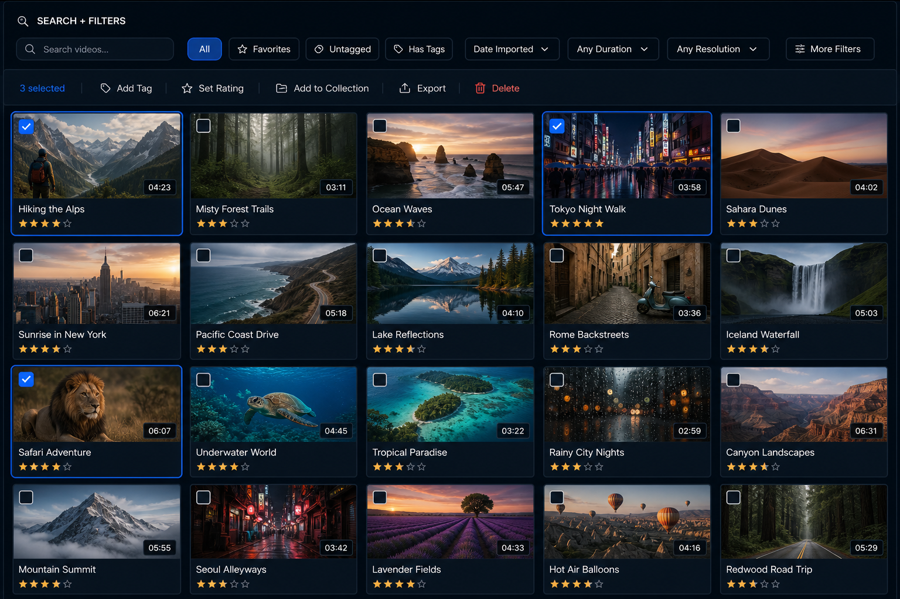

# Fresh Workspace Concepts Audit + Plans
**Date:** 2026-06-28 (evening)  
**Branch context at start:** `feature/dual-mode` (fresh audit performed without assuming any prior implementation direction)  
**Status (2026-06-28):** Curated Wall readiness checklist fully answered. All numbered questions locked. Ready for implementation. See `CuratedWall_Readiness_Checklist.md`.  
**Rules for this audit (per user):**  
- Every serious concept must be accompanied by a detailed plan.  
- Plans must include **specific layout details** (e.g. exact arrangement of fields in the details/inspector/viewer area, hierarchy, grouping, visual weight).  
- Plans must explicitly address **preservation of existing capabilities** — features may be displayed or accessed differently, but nothing important should be lost or made dramatically harder.

---

## Audit Goals (recap)

Create a **distinctive cinematic tool** (not just a styled native Mac app).  
Primary focus areas: flexible viewing + deep organization (rating, tagging, notes, collections, custom metadata).  
Strong viewer/hero treatment.  
Support for both rapid scanning/browsing and careful, deliberate work on individual videos.

---

## Baseline: Current VideoMaster Detail / Inspector Layout (as of latest main)

**Hero / Media Area (top, dominant height)**
- Large framed area for either:
  - Still (Thumbnail) or
  - Filmstrip (multi-row)
- Toggle (AppSegmentedControl): "Thumbnail" | "Filmstrip"
- When filmstrip shown: hint text "Click any frame to start playback from that point"
- Inline player can replace the still/filmstrip when detail-pane playback is active.
- Resize handle below the hero.

**Below hero (scrollable area)**
- **Title section**: Large filename (tap to inline-edit). Full file path shown below (selectable).
- **Details + Attributes row** (two-column layout inside a card-like surface):
  - Left ~2/3: "Details" header (blue accent bar) + 2-column LazyVGrid of:
    - Resolution, Duration, File Size, Codec, Frame Rate, Date Added, Created, Last Played, Plays, Subtitles
  - Thin vertical separator
  - Right ~1/3: Rating + Tags combined
    - "Rating" (blue accent) + star control
    - Divider
    - "Tags" (blue accent) + flow of toggle chips + "New tag" input area
- **Custom metadata section** (when defined): separate header + fields below the above row. Supports text, number, date types. "Various" handling for multi-select.
- Additional notes area (in some prototype branches) or free-text fields.

**Other current capabilities (high level)**
- Grid + List with rich filters (sidebar columns + header search)
- Multi-select (with bulk potential)
- Playback: Detail-pane inline, Overlay floating panel, Fullscreen
- Filmstrip interaction for seeking
- Resume position with banner
- Sidecar subtitles (auto-discover + display)
- Collections (rule-based)
- Re-encoding workflow
- Custom metadata definitions
- Keyboard-heavy navigation, surprise-me, go-to-top, etc.

This baseline is the reference for "must preserve or re-express" in new concepts.

---

## Concept Generation Rules Applied in This Audit

For each concept below:
1. Overall philosophy and workspace model.
2. High-level screen zones.
3. **Detailed layout specification** for the main "Details / Inspector / Viewer" area (field arrangement, grouping, visual hierarchy, interaction).
4. **Preservation of Existing Capabilities** — explicit mapping of major features.
5. Key differences from current app and from the other concepts.
6. Rough implementation notes and open questions.

---

## Concept 1: "Curated Wall + Focused Inspector"

### Philosophy
A cinematic "wall" for browsing that feels like a personal gallery. Strong visual scanning. When you select one (or a small set), the right side or a modal/overlay becomes a rich, dedicated Inspector that is the primary place for organization work. The viewer can be large and prominent but is not the only thing on screen.

### High-Level Zones
- Top: App header + global search + mode-ish affordances (but this concept is mostly single persistent model with strong selection behavior).
- Main: Left-to-middle "Wall" (dense but elegant grid or justified wall of thumbnails with light metadata).
- Right: "Inspector" panel that becomes the focus when an item is selected. The division between Wall and Inspector uses a **movable splitter** (thin divider) so the user can adjust the balance. Widths are constrained within reasonable limits (minimum widths on both sides to preserve usability and the intended visual character).
- Optional large viewer can be invoked from the Inspector or expand in place.

### Detailed Layout – Details / Inspector View (the critical part)

When a single video is selected, the Inspector surface shows (from top to bottom, generous spacing, "liquid" card treatment):

1. **Hero strip** (medium-tall, ~35-40% of inspector height)
   - Large still or filmstrip (switchable with small tabs or segmented control at top-right of the strip).
   - Subtle play overlay button in center.
   - Small duration badge bottom-right.
   - Filmstrip frames are letterboxed correctly, good aspect.

2. **Title block**
   - Large editable title (filename).
   - Small dimmed full path or "in folder X" link.
   - Quick actions row: Play (detail/overlay/full), Reveal in Finder, Quick Tag, Quick Rate.

3. **Core Facts** (tight 2- or 3-column grid, low visual weight)
   - Resolution | Duration | File Size
   - Codec + fps | Date Added | Last Played + Play count
   - Subtitles (shows filename if loaded, or "Yes/No", with "Load..." affordance)

4. **Rating** (prominent, own section)
   - Blue left accent bar + "Rating" label.
   - Large stars (size 22-24) + "Clear" text button on the right.

5. **Tags**
   - Blue left accent + "Tags".
   - Current tags as removable chips (nice rounded, slightly tinted).
   - "Add tag" pill or input that suggests existing tags + allows creation.
   - Optional "Tag mode" that lets you quickly apply the same tags to several wall items.

6. **Notes** (first-class, not buried)
   - Blue left accent + "Notes".
   - Multi-line text area (grows or has reasonable min height, e.g. 120-160pt).
   - Small character counter bottom-right (e.g. 142 / 2000).
   - Auto-save on blur / debounced.

7. **Custom Metadata** (collapsible or always visible section)
   - Grouped under "Custom" with accent.
   - Same fields as today, laid out cleanly (label left, value right or below for longer text).
   - "Various" state clearly shown when multi-select.

8. **Provenance / Technical footer** (very low weight)
   - Created date, file path (copyable), data source.

**Multi-select behavior in Inspector:**
- Shows aggregated view.
- Bulk rating, bulk tag add/remove, bulk notes append (with care), bulk custom fields.

**Interaction model notes:**
- Clicking a wall item selects it and populates the Inspector (no full navigation away from the wall). The wall/inspector split is resizable within limits.
- Double-click or play button in hero opens large viewer (can be overlay or dedicated focus surface).
- The wall remains visible so you can keep scanning while the Inspector is rich.

### Preservation of Existing Capabilities

| Capability                  | How it is preserved / re-expressed in this concept |
|-----------------------------|----------------------------------------------------|
| Filmstrip + frame seeking   | Available inside the Inspector hero strip. Click frame still seeks (when playing from there or when detail player is used). |
| Thumbnail / Filmstrip toggle| Small control at top of hero strip in Inspector. |
| Inline playback (detail)    | Play from hero opens the large viewer in a way that feels like today's detail pane player (or overlay). |
| Overlay + Fullscreen        | Still available from play affordances and global shortcuts. |
| Rating                      | Prominent dedicated section with large stars. |
| Tags (create, apply, filter)| Full chip UI + creation in Inspector. Wall items remain filterable by tag from top filters or sidebar. |
| Collections                 | "Add to Collection" available from quick actions or bulk bar. Collections still drive filters on the wall. |
| Custom metadata             | Full section with all defined fields, properly laid out. |
| Resume playback position    | Banner or control shown when opening player from the hero, same logic as today. |
| Subtitles (sidecar)         | Subtitles row shows filename when loaded; "Load" action available. |
| Search + advanced filters   | Top search + filter dropdowns remain powerful; they filter the wall. |
| Multi-select + bulk         | Wall supports multi-select (checkboxes or modifier-click). Inspector updates to bulk mode. |
| Re-encoding                 | Available from context menu or bulk actions on wall items. |
| Keyboard navigation         | Arrow keys move selection on wall; Enter focuses Inspector or starts playback; standard shortcuts preserved. |

### Pros / Risks
- Strong visual browsing + deep organization in one view.
- Inspector can be very rich without fighting for space with a giant grid.
- Risk: people may want the "wall" to feel more like the current grid (performance, density).

---

## Concept 2: "Dual Intention" (Browse vs Focus) – Refined

(This is the direction we had begun exploring. The audit treats it freshly.)

### Philosophy
Two explicit, named modes the user deliberately chooses between because the **task** is different.

- **Browse** = fast scan, filter, multi-select, bulk organization.
- **Focus** = calm, large viewer + rich inspector for one (or a few) items.

The entire density, chrome, and emphasis changes.

### High-Level Zones (mode-dependent)

**Browse Mode**
- Top: Strong "SEARCH + FILTERS" bar with many visible quick filters + search.
- Main area: Dense, check-boxed grid (or list).
- Contextual toolbar appears on selection: Add Tag, Set Rating, Add to Collection, Export, Delete, etc.
- Right or bottom: Optional compact inspector or hidden.

**Focus Mode**
- Top: Minimal or contextual header.
- Large Viewer (60-70%+ of vertical space).
- Docked or side Inspector below or beside the viewer with full organization tools.
- Thin "context strip" (recently considered items or current multi-selection) can stay visible.

**Switcher**
- Very prominent at top: segmented "Browse" | "Focus" with B / F hints.

### Detailed Layout – Focus Mode Details/Inspector (example)

When in Focus with one item selected:

1. **Large Viewer** (hero)
   - Framed player or high-quality still/filmstrip.
   - Clean transport controls.
   - Small header with filename + close/minimize.

2. **Inspector panel** (directly attached or clearly related, generous padding)
   - **Title** (editable) + path.
   - **Quick facts strip** (single line or very compact 3-4 columns): Res / Duration / Size / Plays + Last Played.
   - **Rating** (large stars, clear button).
   - **Tags** (chips + add).
   - **Notes** (taller text area, 140-180pt min, counter).
   - **Custom fields** (well-spaced, labeled).
   - **Subtitles & technical** (collapsible or footer).

Field arrangement is intentionally more vertical and spacious than today's two-column grid, to encourage deliberate reading/editing.

**Browse Mode** keeps a denser, more horizontal two-column facts grid like today's, because speed matters more.

### Preservation of Existing Capabilities

| Capability               | Browse Mode                          | Focus Mode                              |
|--------------------------|--------------------------------------|-----------------------------------------|
| Filmstrip interaction    | Available on cards or quick preview  | Primary in the large viewer area        |
| Playback modes           | Overlay encouraged for speed         | Large viewer is default; overlay + fullscreen still available |
| Rating / Tags / Notes    | Quick access via bulk toolbar + inspector on selection | Rich, primary, spacious sections        |
| Custom metadata          | Visible in inspector or on demand    | Full featured in Inspector              |
| Multi-select             | First-class (checkboxes + toolbar)   | Supported for small sets; Inspector shows aggregated view |
| Search + filters         | Very prominent, many visible filters | Available but less visually dominant    |
| Resume                   | Works on any playback launch         | Works, possibly with more prominent resume control |
| Collections              | Bulk "Add to Collection"             | Available in Inspector or context       |
| Re-encode, reveal, etc.  | Bulk toolbar + context menu          | Available from viewer header or inspector actions |

---

## Concept 3: "Library Desk 2.0" (Learnings Applied)

### Philosophy
A persistent "desk" bias toward a large, high-quality viewer on the right, with the left side being the working collection of items. The Inspector is not buried — it is a first-class vertical zone attached to the viewer.

### High-Level Zones
- Left: Browser (grid or list) + filter controls (can be top or side).
- Main vertical split: Large Viewer (top-heavy) + docked Inspector below it.
- The Inspector is always visible when something is selected and uses the full width of the right column.

### Detailed Layout – Viewer + Inspector (right column)

**Viewer area (top ~65-70% of right column)**
- Very large framed media (still, filmstrip, or player).
- Picker for Thumbnail / Filmstrip lives above or as overlay affordance.
- Clean playback controls when playing.

**Inspector (bottom ~30-35%, clearly separated but not cramped)**
Vertical stack with good breathing room:

1. Title (large, editable) + small path.
2. Compact facts row (can wrap to two lines): Res • Duration • Size • Codec • fps • Plays • Last Played.
3. Rating (accent bar + stars + clear).
4. Tags (accent + chips + add).
5. Notes (dedicated taller area with counter).
6. Custom metadata (section with consistent field layout: label + control).
7. Subtitles status + quick load.

The key difference from the very first Library Desk prototype is making the Inspector more deliberately sectioned and giving Notes real visual weight.

### Preservation

All core features (filmstrip click-seek, playback modes, resume, subtitles, ratings, tags, custom fields, collections, multi-select via left browser, search/filter) are kept. The browser on the left continues to support dense scanning and multi-select. Bulk actions can be triggered from selection in the left browser even while the right side shows the current primary item.

---

## Visual Mockups (saved locally)

All generated mockups and supporting wireframes from this audit have been copied into the project at:

```
docs/images/workspace-audit-2026-06/
```

Primary concept mockups:

- `browse-mode-dense-grid-mock.png` — Dense Browse-mode grid with filters and bulk toolbar (pairs with Focus)
- `focus-mode-inspector-mock.png` — Large viewer + rich Inspector (Focus state of Dual Mode)
- `library-desk-focus-viewer-inspector-mock.png` — Library Desk layout (large viewer + docked Inspector below)

**Curated Wall refined mockups** (newly generated for this concept):

- `curated-wall-full-window-mock.png` — Full-window view showing the elegant justified "Wall" grid on the left + complete Inspector on the right.
- `curated-wall-cards-refined-mock.png` — Close-up of the refined Wall browsing cards (selection states, hover, elegant metadata, breathing room).
- `curated-wall-inspector-detail-mock.png` — Detailed close-up of the Inspector panel alone (hero strip, title, facts, rating, tags, notes with counter, custom fields).
- `curated-wall-inspector-multiselect-mock.png` — Inspector in multi-select/bulk mode (aggregated values, bulk actions for rating/tags/notes across multiple items).

Additional wireframes (earlier explorations):

- `workspace-dual-mode-wireframe.png`, `refined-dual-mode-wireframe.png`
- `workspace-library-desk-wireframe.png`, `refined-library-desk-wireframe.png`
- `workspace-curators-wall-wireframe.png`, `refined-curators-wall-wireframe.png`
- Others: `workspace-intent-hud-wireframe.png`, `workspace-light-table-wireframe.png`, `workspace-screening-room-wireframe.png`, `workspace-stage-wireframe.png`, `hybrid-library-desk-intention-wireframe.png`

You can reference them in this document using relative paths, e.g.:

```markdown

```

## Next Steps (for this audit)

- Flesh out more precise layout specs (pixel-ish spacing, exact field order, responsive behavior) for the top concepts.
- Add a comparison matrix across the concepts on key dimensions (viewer prominence, organization depth, scanning speed, mode switching cost, implementation risk).
- Rank / discuss with user.
- Only after ranking do we pick one to implement on a dedicated branch, following the build rules.

---

**Status of this document:** Started. Visual mockups generated and saved locally in `docs/images/workspace-audit-2026-06/`. Will continue expanding with more layout precision as needed.

User confirmation received on layout detail + capability preservation requirements before generating the concepts above.
