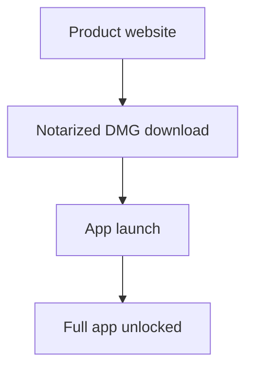
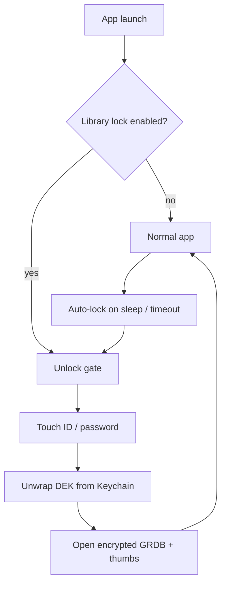
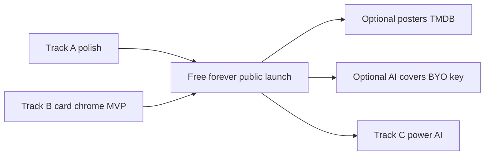

# Skagway go-to-market plan (Mach II Labs)

**Saved:** 2026-07-11  
**Updated:** 2026-07-14 — Developer ID + notarized DMG pipeline (`scripts/package_dmg.sh`)  
**Status:** Planning / not executed  
**Canonical Cursor plan:** `~/.cursor/plans/licensing_trial_purchase_5b99b9a9.plan.md` (historical; **superseded** on Skagway pricing by this doc)  
**This copy:** [`docs/SKAGWAY-GTM-PLAN.md`](SKAGWAY-GTM-PLAN.md) in the Skagway repo — revisit here or in Cursor Plans.

**Overview:** Best Mac local video organizer + premium grid chrome (overlays/vignette); **free forever**; studio credibility first; site on machiilabs.com.

## Open todos

- [x] Developer ID/notarization + DMG pipeline (`scripts/package_dmg.sh`); ROADMAP Phase 4 aligned
- [x] Customer-facing rename to Skagway (locked 2026-07-11); display name, About, DMG, site before public launch
- [ ] machiilabs.com: `/skagway` landing; **free forever** messaging (no “pricing coming later”)
- [ ] machiilabs.com owned (Cloudflare). Add to Vercel; grey-cloud DNS; support@ Email Routing
- [ ] Screenshots, demo, Cinematica compare; category SEO; free-forever story
- [ ] Free-launch checklist (MacStories, Reddit, PH); clear free-forever promise on site
- [ ] Optional library lock: password + Touch ID, Keychain-backed DEK, encrypt GRDB + thumbnails; auto-lock; honest FileVault note
- [ ] Post-launch: iOS companion player (LAN stream + pair auth); Skagway Player
- [ ] Part F Track A: v1.0 readiness + organizer supremacy polish (perf, UX, reliability, docs)
- [ ] Part F Track B: grid chrome MVP; later B2 posters/TMDB; B3 AI Hollywood covers (BYO API key)
- [ ] Part F Track C: power gaps that win vs Cinematica (notes, richer search, auto-import, near-dupes)
- [ ] **Check for updates** — in-app + site path for discovering new builds (Sparkle or equivalent for notarized DMG; About / menu item; appcast on machiilabs.com)
- [ ] **Bug reporting / ticketing / communication** — clear user → studio channel (e.g. support@, GitHub Issues, and/or light in-app “Report a Problem…”); triage workflow Mach II Labs can actually keep up with

**Cancelled (superseded 2026-07-12):** Paddle / LicenseManager / founding Keychain / paid flip for newcomers / Buy CTAs for Skagway. Paid products (e.g. **Ketchikan**) are a separate Mach II Labs product — not Skagway.

---

# Skagway go-to-market: free forever + website + marketing

## Recommendation (locked)

**Primary job of Skagway:** prove **Mach II Labs** ships serious Mac software — polish, performance, honesty — so future products inherit trust. **Not** predicated on a large market for video organizers. **Skagway itself is not a revenue product.** Goodwill and craft are the win.

**Free forever.** Full-featured, no trial clock, no paywall, no “founding then charge later.” **Professional product site** under **Mach II Labs** on **`machiilabs.com`**. Studio revenue (when it comes) is from other products (e.g. **Ketchikan** — trial + one-time purchase), never from locking Skagway.

**Why this product exists (locked, 2026-07-11; pricing clarified 2026-07-12)**
- First full app built with AI-assisted development (developer has decades of shipping experience; AI accelerated the build).
- Niche: local Mac video catalog/organizer — real users exist; not a mass market. Plan does **not** assume viral scale.
- Free forever + serious presentation = best ROI for **studio brand**: downloads, word-of-mouth, SEO footprints, “these people make real software.”
- Future Mach II Labs products sell easier if Skagway felt trustworthy and capable.
- Success metrics (in order): (1) polished public presence, (2) **best-in-class Mac local video organizer** (+ premium grid look), (3) users who’d recommend the studio, (4) category search visibility. **No Skagway revenue metric.**

**Monetization (locked, 2026-07-12)**
- **Skagway is free forever.** Full-featured, no trial, no paywall, no paid tier, no grandfather/cutoff story.
- **No subscriptions — ever** (Mach II Labs company rule).
- **Do not** plan a later paid flip for Skagway newcomers. That model is **retired**.
- **Tip jar:** Optional later nicety only — not the business model; never a substitute for clarity that the app is free.
- **Honest messaging from day one:** Site and press say **free forever**. No bait-and-switch language. No “free during launch.”
- **Studio paid products** (e.g. Ketchikan) are marketed separately; they must not imply Skagway will become paid.

**Privacy (locked, 2026-07-13)**
- **No app telemetry by default.** Skagway must not phone home with usage analytics, automatic diagnostics, library paths, play history, or similar without an explicit, informed user action.
- **Bug reports are user-initiated only.** Prefill may include app/OS version and the user’s own text; never silent upload of library content or browsing behavior.
- Studio **support-process** metrics (e.g. issue counts, time-to-close) are fine and are **not** app telemetry.
- Aligns with free-forever trust: local library software that respects the user’s files and privacy.

**Brand lock-in**
- **Studio display name:** Mach II Labs (Roman numeral — “Mach two”)
- **Only domain:** `machiilabs.com` — no other product domains, vanity `get*`, or `*.app` purchases. Everything ships under this host.
- **Product display name (locked, 2026-07-11):** **Skagway** — obscure Alaska place name; clear Infuse-grade + usability screen (no exact App Store consumer app; no major in-lane video/Mac twin). Soft footnotes only: town tourism at skagway.com; small Bengaluru hospitality SaaS at skagway.tech (not consumer Mac). Companion: **Skagway Player**.
- **Usability bar (locked after Truvo/Fern):** do not suggest names user can’t practically use — exact App Store consumer app with that name, or live major brand owning the word/.com. Soft SEO / place / pronunciation alone don’t kill. Common English words can work (Eagle DAM).
- **Screening rules (locked):** Only reject for reasons that would also kill Infuse / Peakto / VidHub / IINA / Eagle — (1) in-lane Mac video-library peer, (2) wrong product signal, (3) platform giant’s word. Empty Google / soft SEO / metaphor / pronunciation / descriptiveness do **not** disqualify.
- **Also considered (not chosen):** VideoHound (prior working lock — retired); Krag, Krall, Sprawny, Dakota (shortlist leftovers); Fern, Moss, Nebula, Symphony, Juniper, Antares, Fargo, and many others cut in chat deep dives.
- **Product URL:** `https://machiilabs.com/skagway`
- **Voice:** indie software lab shipping multiple Mac products; Skagway is the first public proof of craft (free forever), not the company’s only bet
- **Studio home (`machiilabs.com/`):** short lab story + Skagway as free flagship; room for “coming next” (e.g. Ketchikan) without overselling
- **Do not** style the public studio brand as “Machii” (one word) — always **Mach II**
- **Before ship:** light USPTO / handle pass on Skagway

**Distribution (locked):** Direct download via **Developer ID + notarized DMG** — not Mac App Store first. App is unsandboxed ([`Skagway.entitlements`](../Skagway/Skagway.entitlements)) so it can browse arbitrary folders and optionally use ffmpeg. MAS would require a separate sandboxing project ([`ROADMAP.md`](../ROADMAP.md) Phase 4) and would lower power-user appeal; **do not** pursue MAS for the free-forever launch. Keep ffmpeg as the re-encode engine (no AVFoundation-only replacement as the sole path).

Defaults:
- **Studio domain:** `machiilabs.com` (Cloudflare DNS/nameservers) — sole public web presence
- **Skagway price:** free forever
- Wire DNS when site ships

---

## Part A — Licensing: free forever (no gate)

**No LicenseManager, no Paddle, no Keychain founding stamp, no Buy / Enter key UI for Skagway.**

### Public promise (required)

1. Site, FAQ, About, and press kit: **“Skagway is free forever.”**
2. Never show a paywall, trial countdown, or “Buy” for Skagway.
3. Optional later: quiet “Support Mach II Labs” / tip link — never framed as unlocking features.
4. Do not imply early users are “founding” in a way that suggests later users will pay for Skagway.

### Distro

Developer ID sign + notarize DMG; host under `/downloads/Skagway.dmg` (or equivalent). CTA = **Download free**.

### Tip jar

Out of scope as revenue. Optional “Support Mach II Labs” link later only.

---

## Part B — Professional website

### Starting point (exists today)

Hobby-framed pages already live at:
- [`/other-fun-stuff/Skagway`](file:///Volumes/SSD/CursorProjects/kleimeyer-dot-com/src/app/other-fun-stuff/Skagway/page.jsx) — overview + Download
- [`/other-fun-stuff/Skagway/guide`](file:///Volumes/SSD/CursorProjects/kleimeyer-dot-com/src/app/other-fun-stuff/Skagway/guide/page.jsx) — user guide
- DMG href in [`constants.js`](file:///Volumes/SSD/CursorProjects/kleimeyer-dot-com/src/app/other-fun-stuff/Skagway/constants.js)

That is **not** a product site yet (buried under “other fun stuff,” personal-site chrome).

### Locked site approach

1. **Studio domain (owned):** `machiilabs.com` via Cloudflare Registrar + Cloudflare nameservers.  
2. **Hosting** — same Next.js app on Vercel; add `machiilabs.com` (and `www`) in Vercel; in Cloudflare DNS create Vercel’s records with **DNS only** (grey cloud).  
3. **App routes** — on the Mach II Labs host: `/` = studio home, `/skagway` = product, `/skagway/guide` = docs (middleware when `Host` is `machiilabs.com`).  
4. **Redirects** — `/other-fun-stuff/Skagway*` on kleimeyer.com → `https://machiilabs.com/skagway` (301).  
5. **Standalone product chrome** — no personal-site / OFS nav; wordmark **Mach II Labs** + **Skagway**.  
6. **CTAs:** primary **Download free**; secondary **User guide**. Pricing section = **Free forever** (one line, unambiguous).  
7. **Legal / support** — `support@machiilabs.com` (Email Routing). No Paddle for Skagway.

Env: `NEXT_PUBLIC_PRODUCT_SITE_URL=https://machiilabs.com/skagway`

### SEO (locked: category-first, not brand-first)

Almost nobody will search **Skagway** at launch. They search jobs: **Mac video catalog**, **Mac video organizer**, **Mac video library**, **organize videos on Mac**, **video manager Mac**, **local video library Mac**, and peers (**VidHub alternative**, **Infuse Mac library**, **Cinematica alternative**).

**Rules**
- Brand is for recognition after discovery; **SEO copy targets category queries**.
- Title / H1 / meta: lead with the job, brand second (e.g. “Mac Video Organizer & Library — Skagway”).
- One primary landing for the product; supporting pages or sections that match search intent without keyword stuffing.
- Comparison / alternative pages earn high-intent traffic (“X alternative”, “X vs Y”).
- Guide content = long-tail (“how to organize a large video library on Mac”).
- OG / social same as brand; search snippets optimized for category.

**On-page (machiilabs.com/skagway)**
- `<title>` + meta description: category phrase + outcome (fast / large libraries / files stay put) + Skagway + free
- H1: category-led; logo/wordmark still Skagway
- Body: natural use of catalog / organizer / library / Mac; avoid stuffing
- FAQ answers real queries (free forever, why not Mac App Store / sandbox, ffmpeg optional, vs Infuse/Plex/Cinematica)
- Internal links: studio home ↔ product ↔ guide ↔ compare

**Supporting URLs (same host)**
- `/skagway` — primary product landing  
- `/skagway/guide` — docs + long-tail how-tos  
- `/skagway/vs-cinematica` (and optional `/skagway/vs-infuse`) — alternative intent  
- Optional blog later: “Best Mac video organizers” style posts only if honest and maintained

**Technical SEO**
- Canonical `https://machiilabs.com/skagway` (and per-page canonicals)
- `sitemap.xml` + robots for machiilabs.com host
- Fast Core Web Vitals; real screenshots with descriptive `alt` (“Mac video library grid…”)
- JSON-LD `SoftwareApplication` (name Skagway, OS macOS, category); **offers as free** permanently
- 301 OFS Skagway → `/skagway` (equity + discovery)

**Directories / listings (off-site)**
- MacUpdate, AlternativeTo, Softpedia, Product Hunt: title/tagline = category language first; price = Free
- Press tips: subject lines like “Free Mac video organizer for large libraries” not only “Introducing Skagway”

### Landing page structure (one composition, not a dashboard)

Hero (first viewport only):
- Brand: **Skagway** (Mach II Labs) — visible wordmark
- **Headline = SEO/job language** (organizer / catalog / library for Mac), not a cryptic brand slogan alone
- One supporting sentence (large libraries, files stay put)
- CTA group: **Download free** · User guide
- One dominant product screenshot / short loop (full-bleed or edge-to-edge visual — not a card collage)

Below the fold (one job per section):
- **Why it’s different** — fast with thousands of videos (confirmed vs Cinematica)
- **What you get** — grid, tags, smart collections, albums, player, metadata I/O, optional library lock (tight bullets)
- **How it works** — indexes folders; files stay put
- **Pricing** — **Free forever.** Full app, no trial, no paid tier. (Optional: Mach II Labs may sell other products later; Skagway stays free.)
- **Compare** — short honest table vs Cinematica (performance + modern UX) and vs Infuse (organization depth)
- **FAQ** — free forever, why not App Store, system requirements (macOS 26+), ffmpeg for re-encode, library lock vs FileVault
- **Footer** — support email, guide, GitHub releases optional

### Technical

- Next.js routes under product path (`/skagway`)
- Keep guide content; restyle shell to match product brand
- Screenshots: export from Release build (Curated Wall + player + filters) — dark cinematic look is the brand

---

## Part C — Marketing around launch

### Positioning line (use everywhere)

> Skagway is a fast Mac app for organizing and playing the video files already on your drives — built to stay smooth with large libraries.

**Search / SEO phrasing (titles, directories, ads — not instead of brand):** Mac video organizer · Mac video catalog · Mac video library manager.

**Free-forever line:** Serious Mac video organizer — free forever from Mach II Labs.

Wedge vs Cinematica: **same job, dramatically better at scale.**  
Not competing as Infuse/Plex clone.

### Asset checklist

- **Demo library (not personal media):** `python3 scripts/download_demo_library.py` → `~/Movies/Skagway-Demo-Library/` (~25 clips each: Landscape, Architecture, Arts & Crafts, Automotive). Add that folder as a Skagway data source for screenshots / manuals. Credit Pixabay on public marketing that uses the clips.
- 4–6 stills (wall, inspector, filters, player, collections) with descriptive alts for SEO
- 30–60s silent or lightly captioned demo (download → browse → filter → play)
- App icon + social OG image (1200×630)
- Press kit zip (icon, screenshots, one-pager PDF/Markdown)
- Compare page copy (Cinematica; optional Infuse) aimed at “alternative” queries

### Launch channels (lightweight, sequential)

1. Product site live + notarized DMG (SEO title/meta/JSON-LD day one); **free forever** copy live  
2. Short post: personal network / X / LinkedIn  
3. Mac-focused: MacStories tip inbox, Softpedia/MacUpdate — **category taglines** + free forever  
4. Communities: r/MacApps sparingly (value-first)  
5. Product Hunt once site + DMG are stable  
6. Comparison pages on machiilabs.com  

### In-app ↔ site consistency

- No Buy nag; no license gate  
- About links to `/skagway` and guide; may state free forever  
- Optional tip / support link only — never feature-gated  
- **Check for Updates** and **Report a Problem / Contact** land on the same honest support story as the site (not a dead mailto void)

---

## Part G — Updates + user communication (added 2026-07-13)

Public free software still needs a **trustworthy update path** and a **reachable human channel**. Neither is monetization.

### Check for updates

**Goal:** Users on notarized DMG installs can learn about and install newer Skagway builds without hunting GitHub manually.

**Direction (decide at implement time):**
- Prefer **Sparkle** (or similar) with an appcast hosted under `machiilabs.com` (e.g. `/skagway/appcast.xml`) alongside DMG downloads
- In-app: **Skagway → Check for Updates…** (and optional quiet periodic check)
- About / site show current version; release notes link to changelog or short release page
- Signing: update packages must match the public **Developer ID** story (not ad-hoc)

**Not required for day-one soft launch** if downloads are infrequent and you announce on the site — but should land **before** wide press / PH so early adopters aren’t stranded on build 1.

### Bug reporting / ticketing / communication

**Goal:** Users can report bugs and ask questions; Mach II Labs can triage without drowning.

**Direction (pick one primary + optional secondary):**
- **Email:** `support@machiilabs.com` (already in studio plan) — simplest; in-app “Contact Support…” / “Report a Problem…”
- **Public tracker:** GitHub Issues on the Skagway repo (or a dedicated support repo) — good for transparency; needs labels/templates so noise stays manageable
- **Light in-app reporter (optional later):** prefill app version, macOS version, and a short description; send via email or open a prefilled issue URL — **user-initiated only; no app telemetry by default** (locked privacy principle above)

**Process:** short triage SLA for yourself (even “best effort”); FAQ on site for common issues (sandbox/MAS, ffmpeg, removable volumes). Reuse the same channel for Ketchikan later where possible.

---

## Implementation sequence

0. **Part F Track A + B** — organizer polish + grid card chrome MVP (overlays/vignette); posters/TMDB optional later  
1. Confirm customer-facing Skagway naming + About “free forever” copy  
2. Notarized DMG → public downloads  
3. Domain → Vercel → `/skagway` + OFS redirects + **free forever** copy + SEO  
4. Screenshots / demo / OG / FAQ (show jazzed grid cards)  
5. Soft free launch → press / PH  
6. **Check for updates** (Sparkle/appcast) + **support / bug channel** live on site and in-app  
7. Optional library lock (Part D)  
8. Track C power/AI as post-launch differentiators  
9. Update ROADMAP  

## Effort ballpark

| Workstream | Calendar |
|------------|----------|
| Notarized DMG pipeline | ~1–3 days |
| Professional site + assets | ~1–2 weeks |
| Check for updates (Sparkle + appcast) | ~2–5 days |
| Bug/support channel (email + optional Issues/in-app) | ~1–3 days |
| Library privacy lock (Part D) | ~3–7 days |
| Launch marketing push | ~2–5 days around ship |
| **Total to credible public launch** | **~2–5 weeks** (no licensing workstream) |
| iOS companion player | separate project after Mac GTM |

## Part D — Library privacy lock (optional, real security)

**Goal:** Users who want it can keep others from browsing their library on a shared Mac — with more than a cosmetic lock screen.

**Locked approach (v1):** App lock + **encrypted catalog** (not full video-file vault).

**Explicitly rejected:** Encrypting video files at rest, or ingesting media into a giant DB blob store. Libraries are multi‑TB; files must stay as normal files on disk (index + organize in place). Privacy for media = OS FileVault + folder permissions, not app-owned ciphertext copies.

### What “real” means here

| Protected | Not protected (v1) |
|-----------|-------------------|
| SQLite library DB (paths, tags, ratings, collections, play history) | Video files on disk (still normal files) |
| Thumbnail / filmstrip cache | Finder browsing of source folders |
| In-app UI until unlock | A determined attacker with your unlocked Mac + disk access to media |

**Honest Settings copy (required):** Protects library metadata and thumbnails. Video files stay on disk as usual — enable **FileVault** (and keep folders private) for full-disk protection. Full media vault is a later product if demand exists.

### Product behavior

- **Opt-in** in Settings → Privacy / Security (off by default)
- Set password → confirm → enable Touch ID unlock via `LocalAuthentication`
- **Unlock gate** before any library UI, search, or thumbnail decode
- **Auto-lock:** on Mac sleep, app deactivate (configurable), and after idle timeout
- **Change / disable password** requires current password (or recovery — see below)
- **Export / backup** of DB only when unlocked; exported copies remain user’s responsibility

### Crypto / storage (implementation sketch)

1. Generate random **DEK** (data encryption key); wrap with key derived from password (CryptoKit); store wrapped DEK + salt + verifier in **Keychain**
2. Open GRDB with encryption (SQLCipher / passphrase configuration) using DEK after unlock; never persist DEK in UserDefaults
3. Encrypt or gate thumbnail cache the same way (or wipe memory cache on lock)
4. Biometric unlock: Keychain item accessible after `LocalAuthentication` success (same pattern as password managers — see SafeHaven/Ketchikan `BiometricGate` as reference, different repo)
5. **Recovery:** if password forgotten, library metadata cannot be recovered without a recovery key shown once at enable-time (user must save it). Do not offer a backdoor.

### Threat model (short)

- Stops family / roommate / casual snoop on an unlocked session and hides catalog when locked
- Does **not** claim NSA-grade protection of media files

### Marketing

- Landing / FAQ bullet: “Optional library lock with password and Touch ID”
- Do not overclaim (“military-grade encrypted videos”)

### Sequencing vs GTM

- **Can ship after** site + DMG if needed; strong trust feature for public launch
- Prefer implement before Product Hunt if schedule allows (~several days to a week for solid v1)
- **Full video-file vault** and **iOS companion player** stay out of this GTM pass

---

## Part E — Post-launch: iOS companion player

**Not a launch blocker.** Named follow-on after Mac GTM is stable.

- Mac app runs local library server (Bonjour discover, pair PIN/token, stream)
- iOS app **Skagway Player**: browse + play on LAN first
- Reuse library-lock pairing: companion only works when Mac library is unlocked / server allowed
- Format reality: compatible files direct-stream; incompatible need later transcode story
- AirPlay from Mac remains the zero-app shortcut until companion ships

---

## Part F — Nuke the competition: best organizer + pretty library look

**Locked product bar (2026-07-11):** Be the **best Mac local video organizer** of them all — not merely the best free one — **and** make the library **look intentional**. Do **not** pivot primary identity into Infuse/VidHub (Netflix-style scrape-first media browser). Beat them on organization depth; close the “utilitarian grid” gap with visual polish that works for **all** files (home video, cuts, random MP4s) — not only titled movies.

**Competitive map**
| Peer | Their strength | How Skagway wins |
|------|----------------|---------------------|
| **Cinematica** | Direct organizer peer | Outpace on large-library speed, modern UX, filters/collections/albums, metadata I/O, reliability |
| **Videlion / Movie Explorer** | Lightweight catalog | Deeper power tools + playback + queues + polished grid cards |
| **Infuse / VidHub** | Poster walls, scrape, playback polish | Don’t copy their whole product; **borrow visual density** via card chrome (and optional posters later); stay superior at tags/rules/albums/custom fields/scale |
| **NeoFinder** | Offline drive catalog | Video-native playback + curation workflows |

**Already strong (defend & polish, don’t rebuild):** in-place library, Grid/List + Inspector, Quick/Advanced filters, smart collections, albums, tags/ratings/custom fields, CSV/JSON metadata I/O, multi-mode playback, thumbnails/filmstrips, re-encode/move queues, large-library performance architecture.

### Track A — Organizer supremacy (ship before bragging)

Priority polish that makes “best” believable:
1. **v1.0 readiness** — formal 10k+ perf pass, feature audit vs ROADMAP, security pass on filesystem/ffmpeg paths ([`ROADMAP.md`](../ROADMAP.md))
2. **Zero papercuts** — import/scan reliability, Missing/Corrupt/Duplicates workflows, selection/playback edge cases, keyboard completeness
3. **Auto-import from Data Sources** — watch folders stay fresh without manual Scan (roadmap gap)
4. **Notes field** — searchable, filterable, exportable
5. **Richer search** — beyond filename FTS5: tags, notes, custom fields, path (even before full semantic AI)
6. **Batch power** — multi-select operations feel inevitable, not bolted on
7. **Library lock** (Part D) — differentiator Infuse doesn’t own for personal libraries
8. **Real user guide** — stub [`docs/USER_GUIDE.md`](USER_GUIDE.md) → product-grade guide on site

### Track B — Pretty library look (revised 2026-07-11)

**MVP (preferred first): jazzed-up grid thumbnails** — no TMDB required. Works for every file in a personal library.

Card chrome on the existing thumbnail (composited in UI or cached “display still”):
1. **Title overlay** — readable filename/title on the card (gradient scrim so type stays legible)
2. **Vignette / edge shade** — slight cinematic falloff so stills feel framed, not flat
3. **Status badges** — resume progress, subtitles, rating stars, duration chip (tighten what’s already there into one coherent card language)
4. **Selection / hover** — premium focus ring and hover lift without cheap gloss
5. **Optional type treatments** — truncate smartly; show custom title field when present later
6. **Performance** — must not tank 10k grid scroll (prefer SwiftUI overlays on existing `ThumbnailService` images; avoid re-encoding every thumb unless caching a composed variant proves necessary)

**Why this beats “posters first” for Skagway:** most of the target library isn’t a TMDB movie. Overlays + vignette upgrade **100%** of cards; posters only upgrade matchable titles.

**Later (optional Track B2): posters / artwork**
- Manual poster set/clear / “use current frame”
- Opt-in TMDB (or similar) match + reject/alt
- Poster-forward grid mode when art exists; else fall back to jazzed thumbnail
- Only after MVP chrome feels premium in screenshots

**Later (optional Track B3): AI “Hollywood” covers (user-supplied key)**
- For users who paste their own API key (OpenAI / other image model — pick one provider at implement time): generate a stylized movie-poster cover from title + optional still/keyframes + short prompt
- **Bring-your-own-key only** — Mach II Labs does not foot inference cost; key stays in Keychain; never shipped as a required cloud account
- Opt-in per video or batch (“Generate cover…”); preview → Accept / Retry / Discard; never auto-overwrite without confirm
- Store accepted art as normal poster/artwork on disk (same path as B2); grid uses it like any poster
- Honest UI: “Uses your API key; may leave your Mac; costs apply on your provider account”
- Fits personal libraries with no TMDB hit (home video, cuts, private titles) where a cinematic fake cover still looks premium
- Privacy default: off; no key → feature hidden or disabled with short explanation
- Out of B3 scope: training on user libraries; bundling a studio-paid quota; generating without explicit user action

**Explicitly out of Track B MVP:** scrape-first identity; Plex/Jellyfin client; Apple TV app; HDR codec wars; AI covers (that’s B3).

### Track C — Power features that widen the gap

After A+B MVP are convincing:
- Near-duplicate / perceptual similarity (beyond SHA-256)
- Filename/path auto-tag suggestions (local heuristics first; vision AI later per [`AI-IMPROVEMENTS.md`](../AI-IMPROVEMENTS.md))
- Natural-language → collection rules (local or hybrid)
- Semantic search (Phase 3) once notes + richer fields exist to embed
- Posters/TMDB (B2) if screenshots still feel thin vs Infuse

### Sequencing vs free launch

- **Minimum for “best organizer” claim:** Track A visibly ahead of Cinematica.
- **Minimum for “looks premium”:** Track B card chrome MVP in marketing screenshots.
- Don’t block launch on TMDB/posters or AI covers.
- Studio credibility = craft on A + B chrome, not feature-count vs Infuse.

### Marketing claim language (use carefully)

- Yes: “The fastest, most powerful Mac app for organizing the videos already on your drives — with a library that looks as good as it works. Free forever.”
- No: “Infuse killer” / “best media player on Apple platforms.”
- No: “Free during launch” / “founding users stay free when we start charging.”

---

## Out of scope for this GTM pass

- Mac App Store / StoreKit  
- Sandboxing Skagway for MAS (keeps ffmpeg + multi-drive power)  
- **Any paid flip, Paddle, LicenseManager, or founding Keychain for Skagway**  
- Heavy DRM / anti-piracy theater  
- Subscriptions (Mach II Labs never)  
- Full multi-language marketing site  
- Paid ads (evaluate after organic signal)  
- Encrypting video files at rest (full vault)  
- iOS companion player implementation (post-launch only)  
- Primary pivot to Infuse/VidHub-style scrape-first streaming product (pretty metadata is additive, not a rewrite)  
- Replacing ffmpeg with AVFoundation-only re-encode as the sole path (would drop WMV / many AVI fixes)
